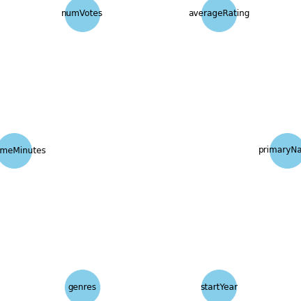

# Hyper-Code

Suggested Python: 3.9.13
### Example


#### Start with creating a Causal Graph with coefficeints
To start with using the ranking query for Hyper, you can obtain a recursive causal graph with coefficeints. In here we read the IMDB data set and use the random forests regression to denote the coefficients.
```python
import pandas as pd
import ranking_funcs
df = ranking_funcs.factor_imdb(pd.read_csv('ranking_data_sets/imdb_movie_stars_v3.csv'))
edges = [
    ("primaryName", "averageRating"), ("primaryName", "numVotes"),("numVotes", "averageRating"),
    ("runtimeMinutes", "numVotes"),("runtimeMinutes", "averageRating"),("genres", "numVotes"),
    ("genres", "runtimeMinutes"),("genres", "averageRating"),("startYear", "averageRating"),
    ("startYear", "numVotes")
]
G = create_G(edges)


new_G_combined=ranking_funcs.get_new_G_combined(G,df)
draw_G_step_by_step(new_G_combined)
```


#### Get the top k ranking through Hyper models
You can find the top k result through the naive apporach. The coefficients in causal graph interpret the intervention. In here we get the top 5 ranking with average rating when we update the column numVotes to 3 for the tupples with primaryName column equals to 10.
```python
naive_top5_ranking=ranking_funcs.get_ranking_query(new_G_combined_rf, df, 5, {'numVotes':3}, 'averageRating',
                         {'primaryName':10},"fix")
```
You also can use Backdoor criterion and backdoor set conditional probability model to get the top 5 ranking. 
```python
bc_top5_ranking=ranking_funcs.predict_backdoor_opt(new_G_combined_rf, df, 5, {'numVotes':3}, 'averageRating',
                         {'primaryName':10},"fix")

bscpm_top5_ranking=ranking_funcs.predict_backdoor_opt2(new_G_combined_rf, df, 5, {'numVotes':3}, 'averageRating',
                         {'primaryName':10},"fix")
```

#### Get the estimated probability of tuples in top k ranking through Hyper
You also can find the estimated probability for the chosen tupples in top k ranking through Hyper models. In here we update the column numVotes to 2 for the tupples with primaryName column equals to 7. Then calculat the tupples $t_{320}$,$t_{140}$,$t_{379}$,$t_{279}$ and $t_{278}$ are in top 5 ranking.
```python
tupples = [320, 140, 379, 279, 278]
naive_top5_prob=ranking_funcs.get_top_k_ranking_query_prob(new_G_combined, df, 5, {'numVotes':2}, 'averageRating',tupples,
                                     {'primaryName':7},'fix')
```
You also can use Backdoor criterion and backdoor set conditional probability model to estimate probability for the above chosen tupples in top 5.
```python
bc_top5_ranking_prob_edit=ranking_funcs.get_prob_backdoor_opt(new_G_combined, df, 5, {'numVotes':2}, 'averageRating',
                                     {'primaryName':7},'fix',tupples)

bscpm_top5_ranking_prob_edit=ranking_funcs.get_prob_backdoor_opt2(new_G_combined, df, 5, {'numVotes':2}, 'averageRating',
                                     {'primaryName':7},'fix',tupples)
```

#### Get the stable ranking
You can obtain the stable ranking for through the continous intervention in Hyper. In here we use the naive algorithm to get the top 3 ranking with average rating when we update the column numVotes to multiply by 3 for the tupples with primaryName column equals to 5.
```python
ranking_funcs.get_ranking_query(new_G_combined, df, 3, {'numVotes':3}, 'averageRating',{'primaryName':5},'multiply_by')
```
If you want to check multiplying column numVotes to multiply by other number can get the same in top 3 result, you can apply the stable ranking here. The stable ranking can help you to do this. In here, we give the stable ranking of 1000 max iteration. 
```python
stable_rank=ranking_funcs.get_stable_ranking_opt(new_G_combined, df, 3, {'numVotes':3}, 'averageRating',{'primaryName':5},1000,'multiply_by')

```
 If you want to check more than 1 stable ranking, you can use the recursive stable ranking.In the recursive stable ranking, ypu can either obtain lower bond or uper bond. In here, we give the stable ranking of 1000 max iteration for each recurssion which is 4000 max iteration total. 
```python

recur_stable_rank=ranking_funcs.get_test_revert_ranking_rec(new_G_combined, df, 3, {'numVotes':3}, 'averageRating',{'primaryName':5},
                            stable_rank,1000,0,3,'lower','multiply_by')
```

## Reproducibility Steps for setup

### Step 1: Download this repo and cd to it

```
git clone https://github.com/sainyam/Hyper-Code
cd Hyper-Code
```

### Step 2: Install dependencies

```
sudo apt-get update
sudo apt-get install virtualenv
virtualenv venv
source ./venv/bin/activate 

pip install -r requirements.txt
```
